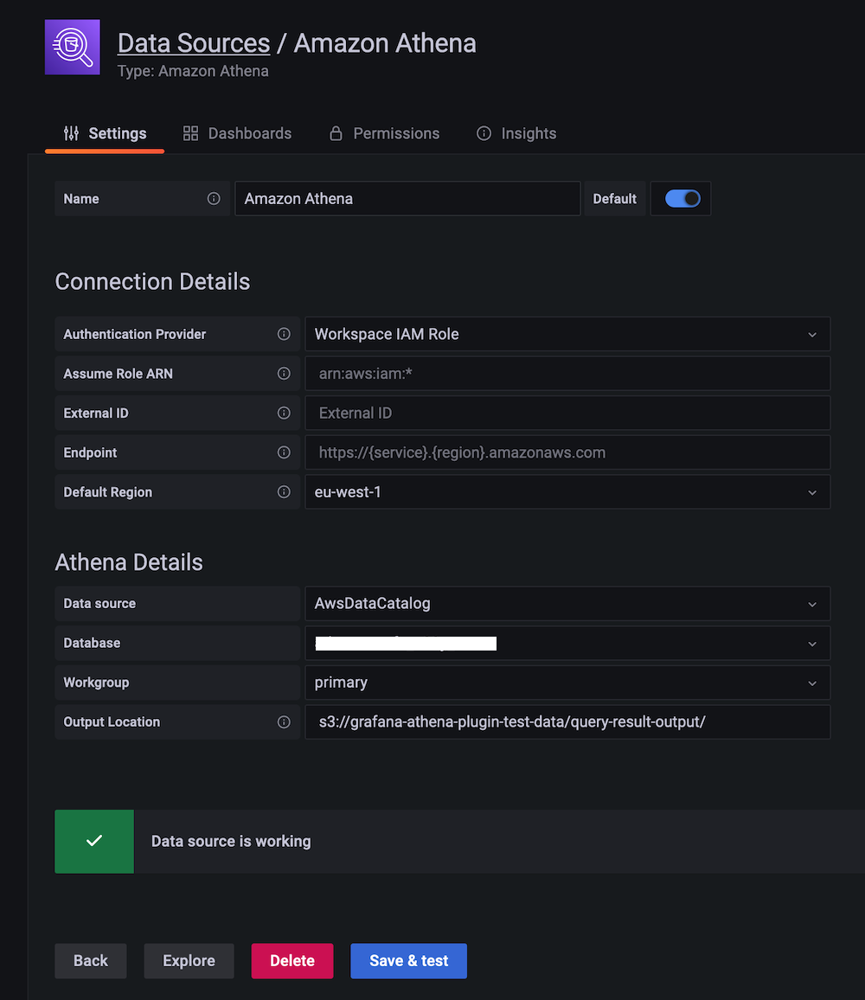

# Using Athena in Amazon Managed Grafana

In this recipe we show you how to use [Amazon Athena][athena]—a serverless, 
interactive query service allowing you to analyze data in Amazon S3 using 
standard SQL—in [Amazon Managed Grafana][amg]. This integration
is enabled by the [Athena data source for Grafana][athena-ds], an open source
plugin available for you to use in any DIY Grafana instance as well as 
pre-installed in Amazon Managed Grafana.

!!! note
    This guide will take approximately 20 minutes to complete.

## Prerequisites

* The [AWS CLI][aws-cli] is installed and [configured][aws-cli-conf] in your environment.
* You have access to Amazon Athena from your account.

## Infrastructure

Let's first set up the necessary infrastructure.

### Set up Amazon Athena
We will use [OpenStreetMap][osm] (OSM) data to demonstrate the usage of the
Athena plugin. For that to work, we need to first get the OSM data into Athena.

So, first off, create a new database in Athena. Go to the [Athena
console][athena-console] and there use the following three 
SQL queries to import the OSM data into the database.

!!! warning
    You have to use the Amazon Athena console to execute these queries. Grafana
	in general has read-only access to the data sources, so can not be used
	to create or update data.

Query 1:

```sql
CREATE EXTERNAL TABLE planet (
  id BIGINT,
  type STRING,
  tags MAP<STRING,STRING>,
  lat DECIMAL(9,7),
  lon DECIMAL(10,7),
  nds ARRAY<STRUCT<ref: BIGINT>>,
  members ARRAY<STRUCT<type: STRING, ref: BIGINT, role: STRING>>,
  changeset BIGINT,
  timestamp TIMESTAMP,
  uid BIGINT,
  user STRING,
  version BIGINT
)
STORED AS ORCFILE
LOCATION 's3://osm-pds/planet/';
```

Query 2:

```sql
CREATE EXTERNAL TABLE planet_history (
    id BIGINT,
    type STRING,
    tags MAP<STRING,STRING>,
    lat DECIMAL(9,7),
    lon DECIMAL(10,7),
    nds ARRAY<STRUCT<ref: BIGINT>>,
    members ARRAY<STRUCT<type: STRING, ref: BIGINT, role: STRING>>,
    changeset BIGINT,
    timestamp TIMESTAMP,
    uid BIGINT,
    user STRING,
    version BIGINT,
    visible BOOLEAN
)
STORED AS ORCFILE
LOCATION 's3://osm-pds/planet-history/';
```

Query 3:

```sql
CREATE EXTERNAL TABLE changesets (
    id BIGINT,
    tags MAP<STRING,STRING>,
    created_at TIMESTAMP,
    open BOOLEAN,
    closed_at TIMESTAMP,
    comments_count BIGINT,
    min_lat DECIMAL(9,7),
    max_lat DECIMAL(9,7),
    min_lon DECIMAL(10,7),
    max_lon DECIMAL(10,7),
    num_changes BIGINT,
    uid BIGINT,
    user STRING
)
STORED AS ORCFILE
LOCATION 's3://osm-pds/changesets/';
```

Now that the OSM data is available in Athena, let's move on to Grafana.

### Set up Amazon Managed Grafana

We need a Grafana instance, so go ahead and set up a new [Amazon Managed Grafana
workspace][amg-workspace], for example by using the [Getting Started][amg-getting-started] guide,
or use an existing one.

!!! note
    To use AWS data source configuration, first go to the Amazon Managed Grafana
    console to enable service-mananged IAM roles that grant the workspace the 
    IAM policies necessary to read the Athena resources.


To set up the Athena data source, use the left-hand toolbar and choose the 
lower AWS icon and then choose "Athena". Select your default region you want 
the plugin to discover the Athena data source to use, and then select the 
accounts that you want, and finally choose "Add data source".


Alternatively, you can manually add and configure the Athena data source by 
following these steps:

1. Click on the "Configurations" icon on the left-hand toolbar and then on "Add data source".
1. Search for "Athena".
1. [OPTIONAL] Configure the authentication provider (recommended: workspace IAM
   role).
1. [OPTIONAL] Select your targeted Athena data source, database, and workgroup.
5. [OPTIONAL] If your workgroup doesn't have an output location configured already,
   specify the S3 bucket and folder to use for query results.
6. Click "Save & test"

You should see something like the following:



## Usage
The SQL query is as follows:


```sql
SELECT tags['amenity'] as amenity, tags['name'] as name, tags['website'] as website, lat, lon from planet
WHERE type = 'node'
  AND tags['amenity'] IN ('bar', 'pub', 'fast_food', 'restaurant')
  AND lon BETWEEN -115.5 AND -114.5
  AND lat BETWEEN 36.1 AND 36.3
LIMIT 500;
```

You can import an example dashboard, available via
[osm-sample-dashboard.json](./amg-athena-plugin/osm-sample-dashboard.json)
that looks as follows:


From here, you can use the following guides to create your own dashboard in
Amazon Managed Grafana:

* [User Guide: Dashboards](https://docs.aws.amazon.com/grafana/latest/userguide/dashboard-overview.html)
* [Best practices for creating dashboards](https://grafana.com/docs/grafana/latest/best-practices/best-practices-for-creating-dashboards/)

That's it, congratulations you've learned how to use Athena from Grafana!

## Cleanup

Remove the OSM data from the Athena database you've been using and then
the Amazon Managed Grafana workspace by removing it from the console.

[athena]: https://aws.amazon.com/athena/
[amg]: https://aws.amazon.com/grafana/
[athena-ds]: https://github.com/grafana/athena-datasource
[aws-cli]: https://docs.aws.amazon.com/cli/latest/userguide/cli-chap-install.html
[aws-cli-conf]: https://docs.aws.amazon.com/cli/latest/userguide/cli-chap-configure.html
[amg-getting-started]: https://aws.amazon.com/blogs/mt/amazon-managed-grafana-getting-started/
[osm]: https://aws.amazon.com/blogs/big-data/querying-openstreetmap-with-amazon-athena/
[athena-console]: https://console.aws.amazon.com/athena/
[amg-workspace]: https://console.aws.amazon.com/grafana/home#/workspaces
