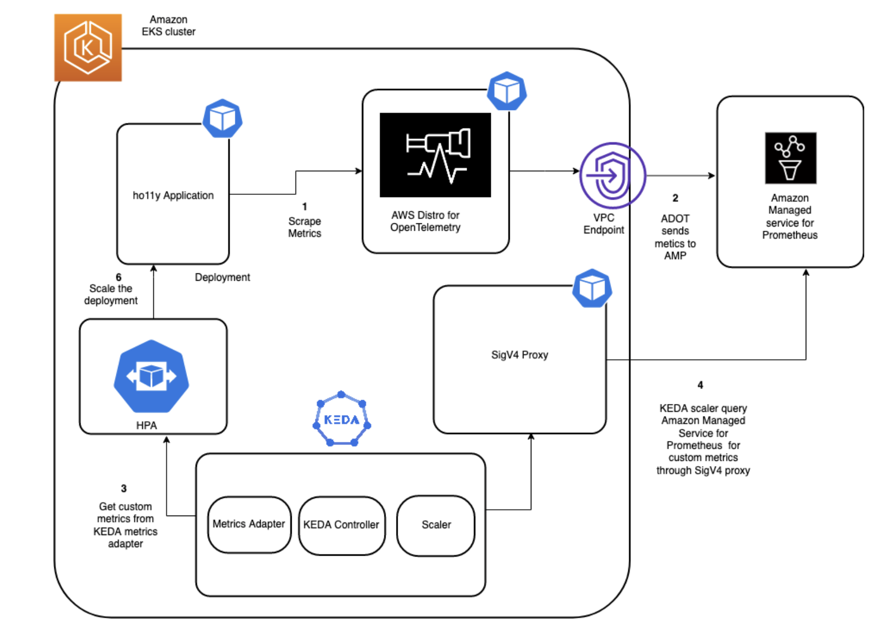

# Proactive autoscaling of Kubernetes workloads with KEDA using metrics ingested into Amazon Managed Service for Prometheus

In this recipe we show you how you can use KEDA to autoscale Amazon EKS Pods by querying the metrics stored in [Amazon Managed Service for Prometheus](https://docs.aws.amazon.com/prometheus/latest/userguide/what-is-Amazon-Managed-Service-Prometheus.html)


!!! note
    This guide will take approximately 45 minutes to complete.

## Prerequisites
You will need the following to complete the steps in this blog post:

[AWS CLI version 2](https://docs.aws.amazon.com/cli/latest/userguide/install-cliv2.html)
[eksctl](https://eksctl.io/)
[kubectl](https://docs.aws.amazon.com/eks/latest/userguide/install-kubectl.html)
[jq](https://stedolan.github.io/jq/download/%20)
[helm](https://www.eksworkshop.com/beginner/060_helm/helm_intro/install/index.html)
An Amazon Managed Service for Prometheus workspace configured in your AWS account. For instructions, see Create a workspace in the Amazon Managed Service for Prometheus User Guide.

## Infrastructure
In the following section we will be setting up the infrastructure for this recipe. 

### Architecture




### Setup an EKS cluster

First, create an Amazon EKS cluster for running the sample application and the KEDA operator. 
The `eksctl` CLI will be used to deploy the cluster using the [eks-cluster-config.yaml](./amp-keda-autoscaling/eks-cluster-config.yaml).
This template will create a new cluster with EKS.

Edit the template file and set your region to one of the available regions for AMP:

* `us-east-1`
* `us-east-2`
* `us-west-2`
* `eu-central-1`
* `eu-west-1`

Make sure to overwrite this region in your session, for example, in the Bash
shell:

```
export AMP_EKS_CLUSTER=AMP-EKS-CLUSTER
export AMP_ACCOUNT_ID=<Your Account id>
export AWS_REGION=<Your Region>
```

Create your cluster using the following command:

```
eksctl create cluster -f eks-cluster-config.yaml
```
This creates an Amazon EKS cluster named AMP-KEDA-CLUSTER and a service account named keda-operator that the KEDA scaler will use.

KEDA performs two key roles within Kubernetes: The Agent activates and deactivates Kubernetes Deployments to scale to and from zero on no events. This is one of the primary roles of the keda-operator container that runs when you install KEDA. KEDA also acts as a Kubernetes metrics server that exposes rich event data, such as queue length or any custom metric to the Horizontal Pod Autoscaler to drive scale out. It is up to the Deployment to consume the events directly from the source. This preserves rich event integration and enables gestures like completing or abandoning queue messages to work out of the box. The metric serving is the primary role of the keda-operator-metrics-apiserver container that runs when you install KEDA.

Next, use the following commands to install the keda operator in the Keda namespace:

```
helm repo add kedacore https://kedacore.github.io/charts
```
We will create the values.yaml for the KEDA operator to set the right security context:

```
cat << EOF > values.yaml
operator:
  name: keda-operator
podSecurityContext:
  fsGroup: 1001
securityContext:
  runAsGroup: 1001
  runAsUser: 1001
serviceAccount:
  create: false
  name: keda-operator
EOF

helm install keda kedacore/keda --namespace keda -f values.yaml
```

### Create an Amazon Managed Service for Prometheus workspace
The Amazon Managed Service for Prometheus workspace ingests the Prometheus metrics collected from envoy. A workspace is a logical and isolated Prometheus server dedicated to Prometheus resources such as metrics. A workspace supports fine-grained access control for authorizing its management, such as update, list, describe, and delete, as well as ingesting and querying metrics.

```
aws amp create-workspace --alias AMP-KEDA --region $AWS_REGION
```

### Deploy sample application and scrape metrics using AWS Distro for OpenTelemetry

we will use a sample application called ho11y, which is a synthetic signal generator letting you test observability solutions for microservices. It emits logs, metrics, and traces in a configurable manner.

To install the application, execute the following commands:

```
git clone https://github.com/aws-observability/aws-o11y-recipes.git

cd ./aws-o11y-recipes/sandbox/ho11y/
docker build . -t "$AMP_ACCOUNT_ID.dkr.ecr.$AWS_REGION.amazonaws.com/ho11y:latest
aws ecr get-login-password --region $AWS_REGION | docker login --username AWS --password-stdin  "$ACCOUNT_ID.dkr.ecr.$AWS_REGION.amazonaws.com"
aws ecr create-repository --repository-name ho11y

docker push "$ACCOUNT_ID.dkr.ecr.$AWS_REGION.amazonaws.com/ho11y:latest"
kubectl create namespace ho11y
cat << EOF > holly.yaml
---
apiVersion: apps/v1
kind: Deployment
metadata:
  name: frontend
spec:
  selector:
    matchLabels:
      app: frontend
  replicas: 1
  template:
    metadata:
      labels:
        app: frontend
    spec:
      containers:
      - name: ho11y
        image: "$ACCOUNT_ID.dkr.ecr.$AWS_REGION.amazonaws.com/ho11y:latest"
        ports:
        - containerPort: 8765
        env:
        - name: DISABLE_OM
          value: "on"
        - name: HO11Y_LOG_DEST
          value: "stdout"
        - name: OTEL_RESOURCE_ATTRIB
          value: "frontend"
        - name: OTEL_EXPORTER_OTLP_ENDPOINT
          value: "adot:4317"
        - name: HO11Y_INJECT_FAILURE
          value: "enabled"
        - name: DOWNSTREAM0
          value: "http://downstream0"
        - name: DOWNSTREAM1
          value: "http://downstream1"
        imagePullPolicy: Always
---
apiVersion: apps/v1
kind: Deployment
metadata:
  name: downstream0
spec:
  selector:
    matchLabels:
      app: downstream0
  replicas: 1
  template:
    metadata:
      labels:
        app: downstream0
    spec:
      containers:
      - name: ho11y
        image: public.ecr.aws/mhausenblas/ho11y:stable
        ports:
        - containerPort: 8765
        env:
        - name: DISABLE_OM
          value: "on"
        - name: HO11Y_LOG_DEST
          value: "stdout"
        - name: OTEL_RESOURCE_ATTRIB
          value: "downstream0"
        - name: OTEL_EXPORTER_OTLP_ENDPOINT
          value: "adot:4317"
        - name: DOWNSTREAM0
          value: "https://mhausenblas.info/"
        imagePullPolicy: Always
---
apiVersion: apps/v1
kind: Deployment
metadata:
  name: downstream1
spec:
  selector:
    matchLabels:
      app: downstream1
  replicas: 1
  template:
    metadata:
      labels:
        app: downstream1
    spec:
      containers:
      - name: ho11y
        image: public.ecr.aws/mhausenblas/ho11y:stable
        ports:
        - containerPort: 8765
        env:
        - name: DISABLE_OM
          value: "on"
        - name: HO11Y_LOG_DEST
          value: "stdout"
        - name: OTEL_RESOURCE_ATTRIB
          value: "downstream1"
        - name: OTEL_EXPORTER_OTLP_ENDPOINT
          value: "adot:4317"
        - name: DOWNSTREAM0
          value: "https://o11y.news/2021-03-01/"
        - name: DOWNSTREAM1
          value: "DUMMY:187kB:42ms"
        - name: DOWNSTREAM2
          value: "DUMMY:13kB:2ms"
        imagePullPolicy: Always
---
apiVersion: v1
kind: Service
metadata:
  name: frontend
spec:
  ports:
  - port: 80
    targetPort: 8765
  selector:
    app: frontend
---
apiVersion: v1
kind: Service
metadata:
  name: downstream0
spec:
  ports:
  - port: 80
    targetPort: 8765
  selector:
    app: downstream0
---
apiVersion: v1
kind: Service
metadata:
  name: downstream1
spec:
  ports:
  - port: 80
    targetPort: 8765
  selector:
    app: downstream1
---
EOF


kubectl apply -f holly.yaml -n ho11y
```

This will create three deployments: frontend, downstream0, and downstream1 and 3 services for each deployment.

```
Admin:~/environment $ kubectl get deployments -n ho11y
NAME          READY   UP-TO-DATE   AVAILABLE   AGE
downstream0   2/2     2            2           4d2h
downstream1   1/1     1            1           4d2h
frontend      1/1     1            1           4d2h

Admin:~/environment $ kubectl get svc -n ho11y
NAME          TYPE        CLUSTER-IP     EXTERNAL-IP   PORT(S)   AGE
downstream0   ClusterIP   10.100.6.63    <none>        80/TCP    4d2h
downstream1   ClusterIP   10.100.8.55    <none>        80/TCP    4d2h
frontend      ClusterIP   10.100.83.92   <none>        80/TCP    4d2h
```

Next, we will have to deploy a collector that can scrape the application metrics emitted by ho11y. Amazon Managed Service for Prometheus does not directly scrape operational metrics from containerized workloads in a Kubernetes cluster. You must deploy and manage a Prometheus server or an OpenTelemetry agent, such as the AWS Distro for OpenTelemetry Collector (ADOT) or the Grafana Agent to perform this task. The ADOT-AMP pipeline lets us use the ADOT Collector to scrape a Prometheus-instrumented application, and then send the scraped metrics to Amazon Managed Service for Prometheus.

#### Configure permissions
We will be deploying the ADOT collector to run under the identity of a Kubernetes service account “amp-iamproxy-service-account”. IAM roles for service accounts (IRSA) lets you associate the AmazonPrometheusRemoteWriteAccess role with a Kubernetes service account, thereby providing IAM permissions to any pod utilizing the service account to ingest the metrics to Amazon Managed Service for Prometheus.

You need kubectl and eksctl CLI tools to run the script. They must be configured to access your Amazon EKS cluster.

```
eksctl create iamserviceaccount --name adot-collector --namespace ho11y --cluster $AMP_KEDA_CLUSTER --attach-policy-arn arn:aws:iam::aws:policy/AmazonPrometheusRemoteWriteAccess --approve 
export WORKSPACE=$(aws amp list-workspaces | jq -r '.workspaces[] | select(.alias=="AMP-KEDA").workspaceId')
export REGION=$AWS_REGION
export REMOTE_WRITE_URL="https://aps-workspaces.$REGION.amazonaws.com/workspaces/$WORKSPACE/api/v1/remote_write"
```

Now using the manifest file, [amp-eks-adot-prometheus-daemonset.yaml](./amp-keda-autoscaling/amp-eks-adot-prometheus-daemonset.yaml), with the scrape configuration to extract envoy metrics we will  deploy the ADOT collector. This example deploys a deployment named adot. The adot deployment collects metrics from pods on the cluster.

```
kubectl apply -f amp-eks-adot-prometheus-daemonset.yaml -n ho11y
```

### Configure sigv4 authentication for querying Amazon Managed Service for Prometheus and setup autoscaling using KEDA scaled object

AWS Signature Version 4 is a process to add authentication information to requests made to AWS APIs using HTTP. The AWS Command Line Interface (AWS CLI) and the AWS SDKs already use this protocol to make calls to the AWS APIs. Amazon Managed Service for Prometheus requires the API calls to have sigv4 authentication, and since KEDA doesn’t support sigv4, we will be deploying a sigv4 proxy service to act as a gateway for KEDA to access the query endpoint of the Amazon Managed Service for Prometheus.

Execute the following commands to deploy the sig-v4 proxy using the manifest file [keda-sigv4.yaml](/amp-keda-autoscaling/):

```
kubectl apply -f keda-sigv4.yaml 
```

Let’s create the ScaledObject that will scale the deployment by querying the metrics stored in Amazon Managed Service for Prometheus.

A ScaledObject represents the desired mapping between an event source, such as a Prometheus metric and the Kubernetes Deployment, StatefulSet, or any Custom Resource that defines /scale subresource.

Behind the scenes, KEDA acts to monitor the event source and feed that data to Kubernetes and the HPA (Horizontal Pod Autoscaler) to drive the rapid scale of a resource. Each replica of a resource is actively pulling items from the event source.

KEDA also supports the scaling behavior that we configure in Horizontal Pod Autoscaler. This means that we can configure pollingInterval, cooldownPeriod, fallback configuration and make your scaling even more powerful.

The following commands will deploy the scaledobject named ho11y-hpa that will query the Amazon Managed Service for Prometheus query endpoint for a metric called holly_total.
holly_total metric represents the number of invokes of the application, and the threshold is specified as 1. Depending on the value over a period of one minute, you can scale in/out the downstream0 deployment between 1 and 10 pods.

We will use the [scaledobject.yaml](./amp-keda-autoscaling/scaledobject.yaml) manifest to deploy the scaledobject that will  also create a HPA object in the ho11y namespace with the configuration specified in the scaledobject.yaml:

```
kubectl apply -f scaledobject.yaml
```

Let’s put some load on the application by running the following command:
```
frontend_pod=`kubectl get pod -n ho11y --no-headers -l app=frontend  -o jsonpath='{.items[*].metadata.name}'`
loop_counter=0
while [ $loop_counter -le 300 ] ; do kubectl exec -n ho11y -it $frontend_pod  -- curl downstream0.ho11y.svc.cluster.local; echo ; loop_counter=$[$loop_counter+1];done
```

Describing the HPA should show something such as the following:

```
kubectl describe hpa -n ho11y

Events:
  Type     Reason                        Age                  From                       Message
  ----     ------                        ----                 ----                       -------
  Normal   SuccessfulRescale             40m                  horizontal-pod-autoscaler  New size: 2; reason: external metric prometheus-http---10-100-166-65-workspaces-ws-597472e4-0868-4752-a5d5-9b654b86b9a5-ho11y_total(&LabelSelector{MatchLabels:map[string]string{scaledobject.keda.sh/name: ho11y-hpa,},MatchExpressions:[]LabelSelectorRequirement{},}) above target

```


## Cleanup

Use the following commands to delete resources created during this post:
```
aws amp delete-workspace --workspace-id $WORKSPACE
eksctl delete cluster $AMP_EKS_CLUSTER
```

