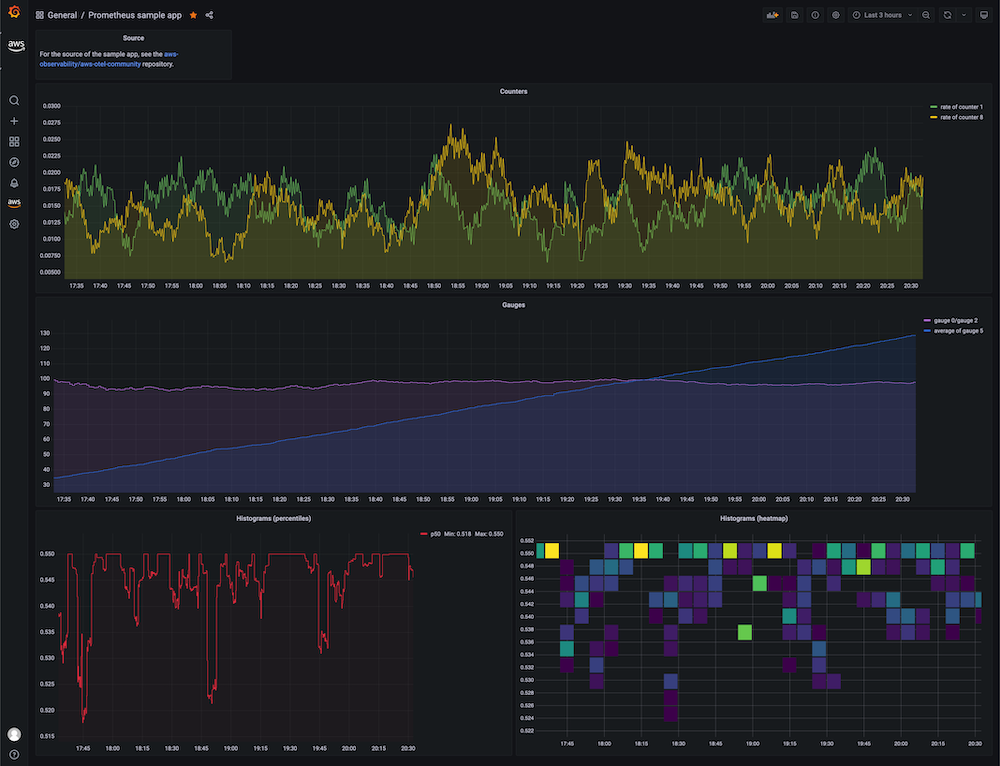

# Using AWS Distro for OpenTelemetry in EKS on Fargate with AWS X-Ray

In this recipe we show you how to instrument a sample Go application
and use [AWS Distro for OpenTelemetry (ADOT)](https://aws.amazon.com/otel) to 
ingest traces into [AWS X-Ray](https://aws.amazon.com/xray/) and visualize
the traces in [Amazon Managed Grafana](https://aws.amazon.com/grafana/).

We will be setting up an [Amazon Elastic Kubernetes Service (EKS)](https://aws.amazon.com/eks/)
on [AWS Fargate](https://aws.amazon.com/fargate/) cluster and use an
[Amazon Elastic Container Registry (ECR)](https://aws.amazon.com/ecr/) repository
to demonstrate a complete scenario.

!!! note
    This guide will take approximately 1 hour to complete.

## Infrastructure
In the following section we will be setting up the infrastructure for this recipe. 

### Architecture

The ADOT pipeline enables us to use the 
[ADOT Collector](https://github.com/aws-observability/aws-otel-collector) to 
collect traces from an instrumented app and ingest them into X-Ray:


### Prerequisites

* The AWS CLI is [installed](https://docs.aws.amazon.com/cli/latest/userguide/cli-chap-install.html) and [configured](https://docs.aws.amazon.com/cli/latest/userguide/cli-chap-configure.html) in your environment.
* You need to install the [eksctl](https://docs.aws.amazon.com/eks/latest/userguide/eksctl.html) command in your environment.
* You need to install [kubectl](https://docs.aws.amazon.com/eks/latest/userguide/install-kubectl.html) in your environment. 
* You have [Docker](https://docs.docker.com/get-docker/) installed into your environment.

### Create EKS on Fargate cluster

Our demo application is a Kubernetes app that we will run in an EKS on Fargate
cluster. So, first create an EKS cluster using the
provided [cluster_config.yaml](./fargate-eks-xray-go-adot-amg/cluster-config.yaml).

Create your cluster using the following command:

```
eksctl create cluster -f cluster-config.yaml
```

### Create ECR repository

In order to deploy our application to EKS we need a container repository. 
You can use the following command to create a new ECR repository in your account: 

```
aws ecr create-repository \
    --repository-name x-ray-sample-app \
    --image-scanning-configuration scanOnPush=true \
    --region eu-west-1
```

### Set up ADOT Collector

Download [adot-collector-fargate.yaml](./fargate-eks-metrics-go-adot-ampamg/adot-collector-fargate.yaml) 
and edit this YAML doc with the parameters described in the next steps.


```
kubectl apply -f adot-collector-fargate.yaml
```

### Set up AMG

Set up a new AMG workspace using the 
[Amazon Managed Grafana – Getting Started](https://aws.amazon.com/blogs/mt/amazon-managed-grafana-getting-started/) guide.

Make sure to add "Amazon Managed Service for Prometheus" as a datasource during creation.


## Application


```
go mod vendor && go run main.go
```


### Build container image

To build the container image for the example app, first, 
clone the [aws-observability/aws-otel-go](https://github.com/aws-observability/aws-otel-go/)
repo locally:

```
git clone https://github.com/aws-observability/aws-otel-go.git
```

Next, change into the `./aws-otel-go/sampleapp/` directory:

```
cd aws-otel-go/sampleapp/
```

Now, set the region and account ID. For example, in the Bash shell this would
look as follows:

```
export REGION="eu-west-1"
export ACCOUNTID=`aws sts get-caller-identity --query Account --output text`
```

Next, build the container image (assuming the Docker daemon is running):

```
docker build . -t "$ACCOUNTID.dkr.ecr.$REGION.amazonaws.com/x-ray-sample-app:latest"
```

Now you can push the container image to the ECR repo you created earlier on.
For that, first log in to the default ECR registry:

```
aws ecr get-login-password --region $REGION | \
    docker login --username AWS --password-stdin \
    "$ACCOUNTID.dkr.ecr.$REGION.amazonaws.com"
```

And finally, push the container image to the ECR repository you created, above:

```
docker push "$ACCOUNTID.dkr.ecr.$REGION.amazonaws.com/x-ray-sample-app:latest"
```

### Deploy sample app

Edit [x-ray-sample-app.yaml](./fargate-eks-xray-go-adot-amg/x-ray-sample-app.yaml)
to contain your ECR image path. That is, replace `ACCOUNTID` and `REGION` in the
file with your own values:

``` 
    # change the following to your container image:
    image: "ACCOUNTID.dkr.ecr.REGION.amazonaws.com/x-ray-sample-app:latest"
```

Now you can deploy the sample app to your cluster using:

```
kubectl apply -f x-ray-sample-app.yaml
```

## End-to-end

Now that you have the infrastructure and the application in place, we will
test out the setup, sending metrics from the Go app running in EKS to AMP and
visualize it in AMG.

### Verify your pipeline is working 

To verify if the ADOT collector is scraping the pod of the sample app and
ingests the metrics into AMP, we look at the collector logs.

Enter the following command to follow the ADOT collector logs:

```
kubectl -n adot-col logs adot-collector -f
```

One example output in the logs of the scraped metrics from the sample app 
should look like the following:

```
...
Resource labels:
     -> service.name: STRING(kubernetes-service-endpoints)
     -> host.name: STRING(192.168.16.238)
     -> port: STRING(8080)
     -> scheme: STRING(http)
InstrumentationLibraryMetrics #0
Metric #0
Descriptor:
     -> Name: test_gauge0
     -> Description: This is my gauge
     -> Unit: 
     -> DataType: DoubleGauge
DoubleDataPoints #0
StartTime: 0
Timestamp: 1606511460471000000
Value: 0.000000
...
```

### Create a Grafana dashboard

You can import an example dashboard, available via
[prometheus-sample-app-dashboard.json](./fargate-eks-metrics-go-adot-ampamg/prometheus-sample-app-dashboard.json),
for the sample app that looks as follows:



Further, use the following guides to create your own dashboard in Amazon Managed Grafana:

* [User Guide: Dashboards](https://docs.aws.amazon.com/grafana/latest/userguide/dashboard-overview.html)
* [Best practices for creating dashboards](https://grafana.com/docs/grafana/latest/best-practices/best-practices-for-creating-dashboards/)

That's it, congratulations you've learned how to use ADOT in EKS on Fargate to 
ingest metrics.

## Cleanup

First remove the Kubernetes resources and destroy the EKS cluster:

```
kubectl delete all --all && \
eksctl delete cluster --name amp-eks-fargate
```


Finally, remove the Amazon Managed Grafana  workspace by removing it via the AWS console. 
