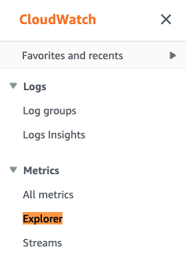
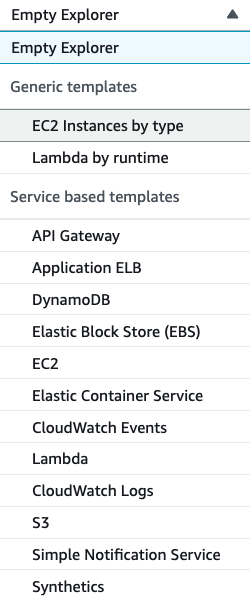
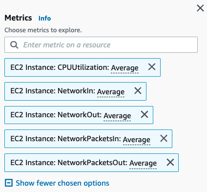
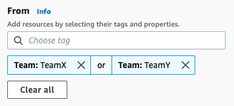
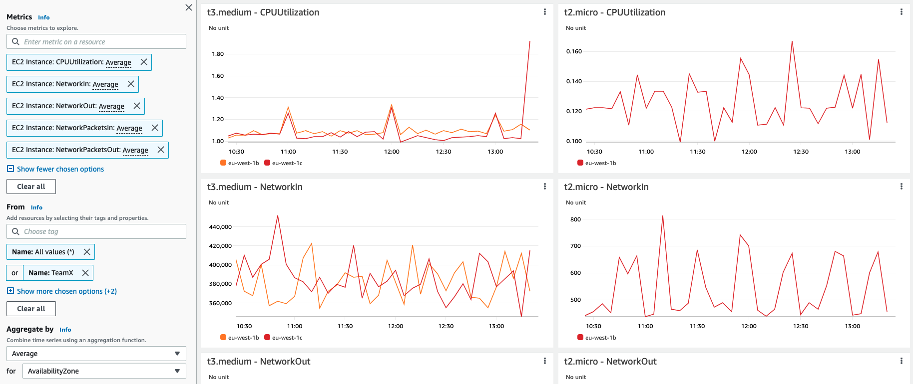
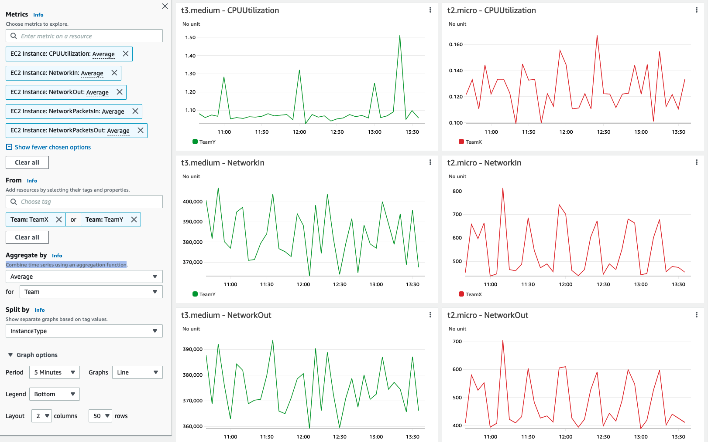

# Using Amazon CloudWatch Metrics explorer to filter, aggregate, and visualize your metrics by resource tags

In this recipe we show you how to use Metrics explorer to filter, aggregate, and visualize metrics by resource tags and resource properties  [Use metrics explorer to monitor resources by their tags and properties](https://docs.aws.amazon.com/AmazonCloudWatch/latest/monitoring/CloudWatch-Metrics-Explorer.html) 

!!! note
    This guide will take approximately 5 minutes to complete.

## Prerequisites

* Access to AWS account(s)
* Access to Amazon CloudWatch Metrics Explorer via AWS Console
* Resoure tags should be set for the relevant resources 

## Metrics Explorer tag based queries

1. Open the CloudWatch console 

2. Under <b>Metrics</b>, click on the <b>Explorer</b> menu  

3. You can either choose one of the <b>Generic templates</b> or from a <b>Service based templates</b> list; in the below examples we used the <b>EC2 Instances by type</b> template

4. Choose metrics you would like to explore (remove obsolete once, add other metrics you would like to see)

5. Under <b>From</b>, choose a resource tag or a resource property you are looking for; in below example we are using Tag named a <b>Team</b>, with <b>TeamX</b> or <b>TeamY</b> as a value

6. You can combine time series using an aggregation function under <b>Aggreagted by</b>; in below example TeamX metrics are aggreagted by Availibility Zone

or you could aggregate <b>TeamX</b> and <b>TeamY</b> by the <b>Team</b> Tag

<!-- width="1622" height="1015" -->

to enhance observability for your services. This gives you a flexible and dynamic troubleshooting experience, so that you to create multiple graphs at a time and use these graphs to build your application health dashboards.

Metrics explorer visualizations are dynamic, so if a matching resource is created after you create a metrics explorer widget and add it to a CloudWatch dashboard, the new resource automatically appears in the explorer widget.

For example, if all of your EC2 production instances have the production tag, you can use metrics explorer to filter and aggregate metrics from all of these instances to understand their health and performance. If a new instance with a matching tag is later created, it's automatically added to the metrics explorer widget.

As an Observability engineer, I would like to be able to filter metric results using resource tags to be able to have group elements form the same resource
example: cpu utilization of all ec2 instances with the tag team:teamX

## Reference

[metrics-explorer]: https://docs.aws.amazon.com/AmazonCloudWatch/latest/monitoring/CloudWatch-Metrics-Explorer.html
[]: 
[]: 
[]: 
