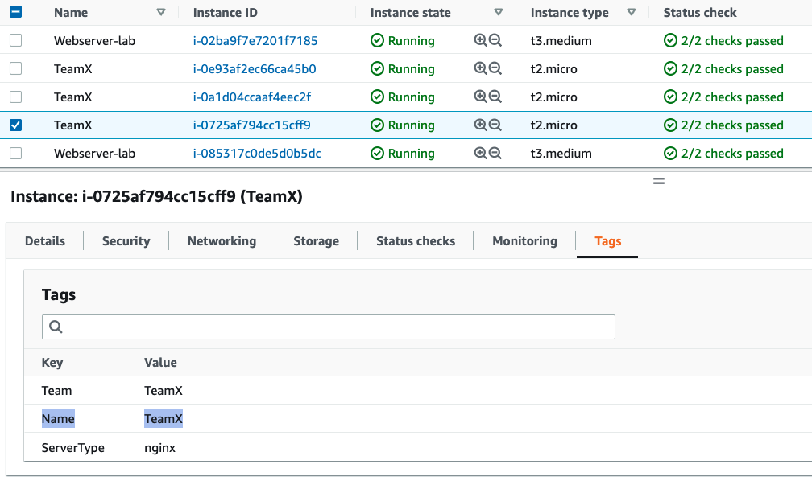

# Using Amazon CloudWatch Metrics explorer to aggregate and visualize metrics filtered by resource tags

In this recipe we show you how to use Metrics explorer to filter, aggregate, and visualize metrics by resource tags and resource properties - [Use metrics explorer to monitor resources by their tags and properties][metrics-explorer].

There are number of ways to create visualizations with Metrics explorer; in this walkthrough we simply leverage the AWS Console.

!!! note
    This guide will take approximately 5 minutes to complete.

## Prerequisites

* Access to AWS account
* Access to Amazon CloudWatch Metrics explorer via AWS Console
* Resource tags set for the relevant resources 

## Metrics Explorer tag based queries and visualizations

1. Open the CloudWatch console 

2. Under <b>Metrics</b>, click on the <b>Explorer</b> menu  

3. You can either choose from one of the <b>Generic templates</b> or a <b>Service based templates</b> list; in this example we used the <b>EC2 Instances by type</b> template

4. Choose metrics you would like to explore; remove obsolete once, and add other metrics you would like to see

5. Under <b>From</b>, choose a resource tag or a resource property you are looking for; in below example we show number of CPU and Network related metrics for different EC2 instances with <b>Name: TeamX</b> Tag

<!-- width="386" height="176" -->

6. Please note, you can combine time series using an aggregation function under <b>Aggregated by</b>; in the below example <b>TeamX</b> metrics are aggregated by <b>Availability Zone</b>

Alternatively, you could aggregate <b>TeamX</b> and <b>TeamY</b> by the <b>Team</b> Tag, or choose any other configuration that suits your needs

## Dynamic visualizations
You can easily customize resulting visualizations by using <b>From</b>, <b>Aggregated by</b> and <b>Split by</b> options. Metrics explorer visualizations are dynamic, so any new tagged resource automatically appears in the explorer widget.

## Reference

For more information on Metrics explorer please refer to the following article:
https://docs.aws.amazon.com/AmazonCloudWatch/latest/monitoring/CloudWatch-Metrics-Explorer.html

[metrics-explorer]: https://docs.aws.amazon.com/AmazonCloudWatch/latest/monitoring/CloudWatch-Metrics-Explorer.html
