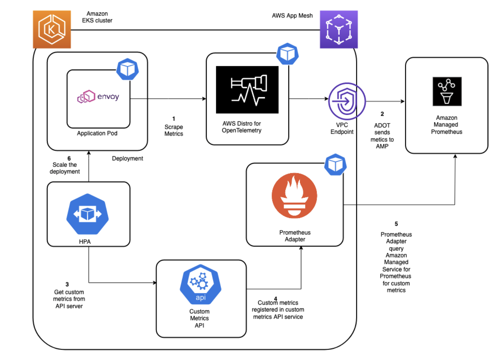

# Using Prometheus Adapter to autoscale applications running on Amazon EKS

In this recipe we show you how to utilize [Prometheus Adapter](https://github.com/kubernetes-sigs/prometheus-adapter) to autoscale [Amazon EKS](https://aws.amazon.com/eks/) Pods running an Amazon [App Mesh](https://docs.aws.amazon.com/app-mesh/) workload. [AWS App Mesh](https://docs.aws.amazon.com/app-mesh/) is a service mesh that makes it easy to monitor and control services. A service mesh is an infrastructure layer dedicated to handling service-to-service communication, usually through an array of lightweight network proxies deployed alongside the application code. We will be registering the custom metric via a Kubernetes API service that HPA will eventually use to make scaling decisions.


!!! note
    This guide will take approximately 45 minutes to complete.

## Prerequisites
You will need the following to complete the steps in this blog post:

[AWS CLI version 2](https://docs.aws.amazon.com/cli/latest/userguide/install-cliv2.html)
[eksctl](https://eksctl.io/)
[kubectl](https://docs.aws.amazon.com/eks/latest/userguide/install-kubectl.html)
[jq](https://stedolan.github.io/jq/download/%20)
[helm](https://www.eksworkshop.com/beginner/060_helm/helm_intro/install/index.html)
An Amazon Managed Service for Prometheus workspace configured in your AWS account. For instructions, see Create a workspace in the Amazon Managed Service for Prometheus User Guide.
## Infrastructure
In the following section we will be setting up the infrastructure for this recipe. 

### Architecture




We will create a custom metric for the counter exposed by envoy, which is the “envoy_cluster_upstream_rq“. This can be extended to any custom metrics that the application emits.


### Setup an EKS cluster

First, create an EKS cluster that will be enabled with App Mesh for running the sample application. 
The `eksctl` CLI will be used to deploy the cluster using the [eks-cluster-config.yaml](./prometheus-adapter-custom-metric-autoscaling/eks-cluster-config.yaml).
This template will create a new cluster with EKS.

Edit the template file and set your region to one of the available regions for AMP:

* `us-east-1`
* `us-east-2`
* `us-west-2`
* `eu-central-1`
* `eu-west-1`

Make sure to overwrite this region in your session, for example, in the Bash
shell:

```
export AMP_EKS_CLUSTER=AMP-EKS-CLUSTER
export AMP_ACCOUNT_ID=<Your Account id>
export AWS_REGION=<Your Region>
```

Create your cluster using the following command:

```
eksctl create cluster -f eks-cluster-config.yaml
```
This creates an EKS cluster named `AMP-EKS-CLUSTER` and a service account 
named `appmesh-controller` that will be used by the App Mesh controller for EKS.

### Install App Mesh Controller

Next, we will run the below commands to install the [App Mesh Controller](https://docs.aws.amazon.com/app-mesh/latest/userguide/getting-started-kubernetes.html) 
and configure the Custom Resource Definitions (CRDs): 

```
helm repo add eks https://aws.github.io/eks-charts
```

```
helm upgrade -i appmesh-controller eks/appmesh-controller \
     --namespace appmesh-system \
     --set region=${AWS_REGION} \
     --set serviceAccount.create=false \
     --set serviceAccount.name=appmesh-controller
```
### Deploy sample application and enable AWS App Mesh
To install an application and inject an envoy container, use the AWS App Mesh controller for Kubernetes that you created earlier. [AWS App Mesh Controller for K8s](https://github.com/aws/aws-app-mesh-controller-for-k8s) manages App Mesh resources in your Kubernetes clusters. The controller is accompanied by CRDs that allow you to define AWS App Mesh components, such as meshes and virtual nodes, via the Kubernetes API just as you define native Kubernetes objects, such as deployments and services. These custom resources map to AWS App Mesh API objects that the controller manages for you. The controller watches these custom resources for changes and reflects them into the AWS App Mesh API.

```
## Install the base application
git clone https://github.com/aws/aws-app-mesh-examples.git 
kubectl apply -f aws-app-mesh-examples/examples/apps/djapp/1_base_application

kubectl get all -n prod ## check the pod status and make sure it is running
## Now install the App Mesh controller and meshify the deployment
kubectl apply -f aws-app-mesh-examples/examples/apps/djapp/2_meshed_application/
kubectl rollout restart deployment -n prod dj jazz-v1 metal-v1
kubectl get all -n prod ## Now we should see two containers running in each pod
```

### Create an Amazon Managed Service for Prometheus workspace

The Amazon Managed Service for Prometheus workspace ingests the Prometheus metrics collected from envoy. A workspace is a logical and isolated Prometheus server dedicated to Prometheus resources such as metrics. A workspace supports fine-grained access control for authorizing its management, such as update, list, describe, and delete, as well as ingesting and querying metrics.

```
aws amp create-workspace --alias AMP-APPMESH --region $AWS_REGION
```

Next, optionally create an interface VPC endpoint in order to securely access the managed service from resources deployed in your VPC. An Amazon Managed Service for Prometheus public endpoint is also available. This ensures that data ingested by the managed service won’t leave your AWS account VPC. Utilize the AWS CLI as shown here. Replace the placeholder strings, such as VPC_ID, AWS_REGION, with your values.

```
export VPC_ID=<Your EKS Cluster VPC Id>
aws ec2 create-vpc-endpoint \ 
--vpc-id $VPC_ID \ 
--service-name com.amazonaws.<$AWS_REGION>.aps-workspaces \ 
--security-group-ids <SECURITY_GROUP_IDS> \ 
--vpc-endpoint-type Interface \ 
--subnet-ids <SUBNET_IDS>
```

### Scrape the metrics using AWS Distro for OpenTelemetry

Amazon Managed Service for Prometheus does not directly scrape operational metrics from containerized workloads in a Kubernetes cluster. You must deploy and manage a [Prometheus](https://github.com/prometheus-community/helm-charts) server or an OpenTelemetry agent such as the [AWS Distro for OpenTelemetry Collector](https://aws-otel.github.io/docs/getting-started/collector) or the Grafana Agent in order to perform this task. This post will walk you through the configuring of the AWS Distro for Open Telemetry (ADOT) in order to scrape the envoy metrics. The ADOT-AMP pipeline lets us use the ADOT Collector to scrape a Prometheus-instrumented application, and then send the scraped metrics to Amazon Managed Service for Prometheus.

#### Configure permissions
We will be deploying the ADOT collector to run under the identity of a Kubernetes service account “amp-iamproxy-service-account”. With [IAM roles for service accounts (IRSA)](https://docs.aws.amazon.com/eks/latest/userguide/iam-roles-for-service-accounts.html), you can associate the AmazonPrometheusRemoteWriteAccess role with a Kubernetes service account, thereby providing IAM permissions to any pod utilizing the service account to ingest the metrics to Amazon Managed Service for Prometheus.

You need kubectl and eksctl CLI tools in order to run the script. They must be configured to access your Amazon EKS cluster.

```
kubectl create namespace prometheus
eksctl create iamserviceaccount --name amp-iamproxy-service-account --namespace prometheus --cluster $AMP_EKS_CLUSTER --attach-policy-arn arn:aws:iam::aws:policy/AmazonPrometheusRemoteWriteAccess --approve
export WORKSPACE=$(aws amp list-workspaces | jq -r '.workspaces[] | select(.alias=="AMP-APPMESH").workspaceId')
export REGION=$AWS_REGION
export REMOTE_WRITE_URL="https://aps-workspaces.$REGION.amazonaws.com/workspaces/$WORKSPACE/api/v1/remote_write"
```
We will now use the [amp-eks-adot-prometheus-daemonset.yaml](./prometheus-adapter-custom-metric-autoscaling/amp-eks-adot-prometheus-daemonset.yaml), with the scrape configuration in order to extract envoy metrics and deploy the ADOT collector. This example deploys a DaemonSet named adot-collector. The adot-collector DaemonSet collects metrics from pods on the cluster.amp-eks-adot-prometheus-daemonset.yaml, with the scrape configuration in order to extract envoy metrics and deploy the ADOT collector. This example deploys a DaemonSet named adot-collector. The adot-collector DaemonSet collects metrics from pods on the cluster.

```
kubectl apply -f amp-eks-adot-prometheus-daemonset.yaml
```

After the ADOT collector is deployed, it will collect the metrics and ingest them into the specified Amazon Managed Service for Prometheus workspace. The scrape configuration is similar to that of a Prometheus server. We will add the necessary configuration for scraping envoy metrics.


### Deploy the Prometheus Adapter to register custom metric
We will be creating a serviceaccount “monitoring” that will be used to run the Prometheus adapter. We will also be assigning the AmazonPrometheusQueryAccess permission using IRSA. The adapter will be using a  configmap [pma-cm.yaml](./prometheus-adapter-custom-metric-autoscaling/pma-cm.yaml)

```
kubectl create namespace monitoring
eksctl create iamserviceaccount --name monitoring --namespace monitoring --cluster AMP-EKS-CLUSTER --attach-policy-arn arn:aws:iam::aws:policy/AmazonPrometheusQueryAccess --approve --override-existing-serviceaccounts
kubectl apply -f  pma-cm.yaml

openssl req -new -newkey rsa:4096 -x509 -sha256 -days 365 -nodes -out serving.crt -keyout serving.key -subj "/C=CN/CN=custom-metrics-apiserver.monitoring.svc.cluster.local"
kubectl create secret generic -n monitoring cm-adapter-serving-certs --from-file=serving.key=./serving.key --from-file=serving.crt=./serving.crt   

```
The Envoy sidecar utilized by AWS App Mesh exposes a counter envoy_cluster_upstream_rq_total. You can configure the Prometheus adapter to transform this metric into req/sec rate. Below is the Prometheus adapter configuration information. The adapter will be connecting to the Amazon Managed Service for Prometheus’s query endpoint through sigv4 proxy.

We will now deploy the Prometheus adapter to create the custom metric: [prometheus-adapter.yaml](./prometheus-adapter-custom-metric-autoscaling/prometheus-adapter.yaml)

```
kubectl apply -f prometheus-adapter.yaml
```

We will create an API service so that our Prometheus adapter is accessible by Kubernetes API. Therefore, metrics can be fetched by our Horizontal Pod Autoscaler. We can query the custom metric API to see if the metric has been created.

```
kubectl get --raw /apis/custom.metrics.k8s.io/v1beta1 |jq .
{
  "kind": "APIResourceList",
  "apiVersion": "v1",
  "groupVersion": "custom.metrics.k8s.io/v1beta1",
  "resources": [
    {
      "name": "pods/appmesh_requests_per_second",
      "singularName": "",
      "namespaced": true,
      "kind": "MetricValueList",
      "verbs": [
        "get"
      ]
    },
    {
      "name": "namespaces/appmesh_requests_per_second",
      "singularName": "",
      "namespaced": false,
      "kind": "MetricValueList",
      "verbs": [
        "get"
      ]
    }
  ]
}
```

Now you can use the appmesh_requests_per_second metric in the HPA definition with the following HPA resource:

```
cat > hpa.yaml <<EOF
apiVersion: autoscaling/v2beta1
kind: HorizontalPodAutoscaler
metadata:
  name: envoy-hpa
  namespace: prod
spec:
  scaleTargetRef:
    apiVersion: apps/v1
    kind: Deployment
    name: jazz-v1
  minReplicas: 1
  maxReplicas: 10
  metrics:
    - type: Pods
      pods:
        metricName: appmesh_requests_per_second
        targetAverageValue: 10m
EOF
kubectl apply -f hpa.yaml
```

Now, we will be able to scale the pods when the threshold for the metric “appmesh_request_per_second” exceeds 10.

Let us add some load to experience the autoscaling actions:

```
dj_pod=`kubectl get pod -n prod --no-headers -l app=dj -o jsonpath='{.items[*].metadata.name}'`
loop_counter=0
while [ $loop_counter -le 300 ] ; do kubectl exec -n prod -it $dj_pod -c dj -- curl jazz.prod.svc.cluster.local:9080 ; echo ; loop_counter=$[$loop_counter+1] ; done
```

Describing the HPA will show the scaling actions resulting from the load we introduced.

```
kubectl describe hpa -n prod

Name:                                     envoy-hpa
Namespace:                                prod
Labels:                                   <none>
Annotations:                              <none>
CreationTimestamp:                        Mon, 06 Sep 2021 04:19:37 +0000
Reference:                                Deployment/jazz-v1
Metrics:                                  ( current / target )
  "appmesh_requests_per_second" on pods:  622m / 10m
Min replicas:                             1
Max replicas:                             10
Deployment pods:                          8 current / 10 desired
Conditions:
  Type            Status  Reason            Message
  ----            ------  ------            -------
  AbleToScale     True    SucceededRescale  the HPA controller was able to update the target scale to 10
  ScalingActive   True    ValidMetricFound  the HPA was able to successfully calculate a replica count from pods metric appmesh_requests_per_second
  ScalingLimited  True    TooManyReplicas   the desired replica count is more than the maximum replica count
  
  Events:
  Type     Reason               Age                 From                       Message
  ----     ------               ----                ----                       -------
  Warning  FailedGetPodsMetric  58m (x44 over 69m)  horizontal-pod-autoscaler  unable to get metric appmesh_requests_per_second: unable to fetch metrics from custom metrics API: the server could not find the metric appmesh_requests_per_second for pods
  Normal   SuccessfulRescale    41s                 horizontal-pod-autoscaler  New size: 4; reason: pods metric appmesh_requests_per_second above target
  Normal   SuccessfulRescale    26s                 horizontal-pod-autoscaler  New size: 8; reason: pods metric appmesh_requests_per_second above target
  Normal   SuccessfulRescale    11s                 horizontal-pod-autoscaler  New size: 10; reason: pods metric appmesh_requests_per_second above target
  ```


## Cleanup

Use the following commands to delete resources created during this post:
```
aws amp delete-workspace --workspace-id $WORKSPACE
eksctl delete cluster $AMP_EKS_CLUSTER
```

