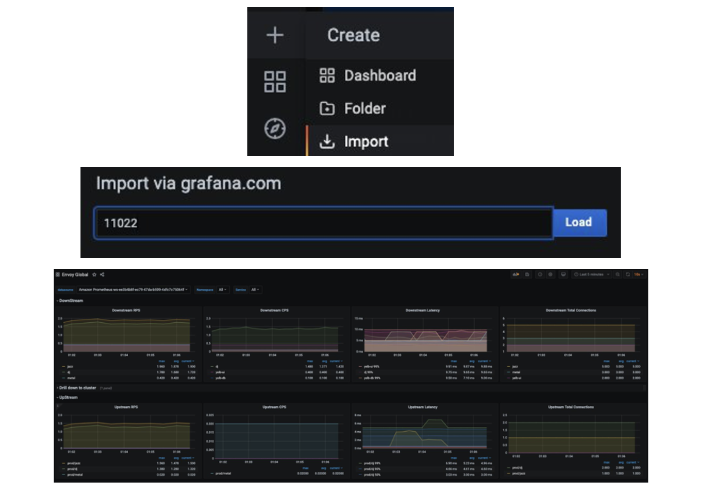

# Using Amazon Managed Service for Prometheus to monitor App Mesh environment configured on EKS

In this recipe we show you how to ingest [App Mesh](https://docs.aws.amazon.com/app-mesh/) envoy metrics in an Amazon EKS cluster to [Amazon Managed Service for Prometheus AMP](https://aws.amazon.com/prometheus/) and create a custom dashboard on [Amazon Managed Service for Grafana](https://aws.amazon.com/grafana/) to monitor the health and performance of microservices.


As part of the implementation, we will create an AMP workspace, install the App Mesh Controller for Kubernetes and inject the envoy container into the pods. We will be collecting the envoy metrics using [Grafana Agent](https://github.com/grafana/agent) configured in the EKS Cluster  [Amazon Elastic Kubernetes Service (EKS)](https://aws.amazon.com/eks/) cluster and write them to AMP. Finally, we will be creating an AMG workspace and configure the AMP as the datasource and create a custom dashboard.

!!! note
    This guide will take approximately 45 minutes to complete.

## Infrastructure
In the following section we will be setting up the infrastructure for this recipe. 

### Architecture


The Grafana agent is configured to scrape the envoy metrics and ingest them to AMP through the AMP remote write endpoint 

!!! info 
    For more information on Prometheus Remote Write Exporter check out:
    [Getting Started with Prometheus Remote Write Exporter for AMP](https://aws-otel.github.io/docs/getting-started/prometheus-remote-write-exporter)


### Prerequisites

* The AWS CLI is [installed](https://docs.aws.amazon.com/cli/latest/userguide/cli-chap-install.html) and [configured](https://docs.aws.amazon.com/cli/latest/userguide/cli-chap-configure.html) in your environment.
* You need to install the [eksctl](https://docs.aws.amazon.com/eks/latest/userguide/eksctl.html) command in your environment.
* You need to install [kubectl](https://docs.aws.amazon.com/eks/latest/userguide/install-kubectl.html) in your environment. 
* You have [docker](https://docs.docker.com/get-docker/) installed into your environment.
* You need AMP workspace configured in your AWS account [Create-workspace](https://docs.aws.amazon.com/prometheus/latest/userguide/AMP-onboard-create-workspace.html)
* You need to install [helm](https://www.eksworkshop.com/beginner/060_helm/helm_intro/install/index.html)
* You need to enable [AWS-SSO](https://docs.aws.amazon.com/singlesignon/latest/userguide/step1.html)

### Setup an EKS cluster

First, create an EKS cluster that will be enabled with App Mesh for running the sample application.  The eksctl CLI tool will be used to deploy the cluster using the [eks-cluster-config.yaml](./servicemesh-monitoring-ampamg/eks-cluster-config.yaml).

This template will create a new cluster with EKS.

Edit the template file and set your region to one of the available regions for AMP:

* `us-east-1`
* `us-east-2`
* `us-west-2`
* `eu-central-1`
* `eu-west-1`

Make sure to overwrite this region in your session, for example in bash:
```
export AWS_REGION=eu-west-1
```

Create your cluster using the following command.
```
eksctl create cluster -f eks-cluster-config.yaml
```
This creates an EKS cluster named AMP-EKS-CLUSTER and a service account named appmesh-controller that will be used by the App Mesh controller for EKS.

### Install the App Mesh Controller

Next, we will run the below commands to install the [App Mesh Controller](https://docs.aws.amazon.com/app-mesh/latest/userguide/getting-started-kubernetes.html) and configure the Custom Resource Definitions 

```
helm repo add eks https://aws.github.io/eks-charts
helm upgrade -i appmesh-controller eks/appmesh-controller \
--namespace appmesh-system \
--set region=${AWS_REGION} \
--set serviceAccount.create=false \
--set serviceAccount.name=appmesh-controller
```

### Setup AMP 
The AMP workspace is used to ingest the Prometheus metrics collected from envoy. A workspace is a logical and isolated Prometheus server dedicated to Prometheus resources such as metrics. A workspace supports fine-grained access control for authorizing its management such as update, list, describe, and delete, and the ingestion and querying of metrics.

create a workspace using the AWS CLI 
```
aws amp create-workspace --alias AMP-APPMESH --region $AWS_REGION
```
Add the necessary helm repositories
```
helm repo add prometheus-community https://prometheus-community.github.io/helm-charts
helm repo add kube-state-metrics https://kubernetes.github.io/kube-state-metrics 
```


!!! info
    For more details check out the [AMP Getting started](https://docs.aws.amazon.com/prometheus/latest/userguide/AMP-getting-started.html) guide.


### Scrape the metrics 

AMP does not directly scrape operational metrics from containerized workloads in a Kubernetes cluster. You must deploy and manage a  Prometheus server or an OpenTelemetry agent such as the AWS Distro for OpenTelemetry Collector or the Grafana Agent to perform this task. In this receipe, we walk you through the process of configuring the Grafana Agent to scrape the envoy metrics and analyze them using AMP and AMG.

### Configure the Grafana Agent for AMP

The Grafana Agent is a lightweight alternative to running a full Prometheus server. It keeps the necessary parts for discovering and scraping Prometheus exporters and sending metrics to a Prometheus-compatible backend, which in this case is AMP, and removes subsystems such as the storage, query, and alerting engines. The Grafana Agent is 100 percent compatible with Prometheus metrics and uses the Prometheus service discovery, scraping, write-ahead log, and remote write mechanisms from the Prometheus project. The Grafana Agent also supports basic sharding across every node in your Amazon EKS cluster by only collecting metrics running on the same node as the Grafana Agent pod, removing the need to decide between one giant machine to collect all of your Prometheus metrics and sharding through multiple manually managed Prometheus configurations. The Grafana Agent also includes native support for AWS Signature Version 4 for AWS Identity and Access Management (IAM) authentication, which means you don’t need to run a sidecar Signature Version 4 proxy, which reduces complexity, memory, and CPU demand.

In this receipe, we walk through the steps to configure an IAM role to send Prometheus metrics to AMP. We install the Grafana Agent on the EKS cluster and forward metrics to AMP.

### Configure Permissions
The Grafana Agent scrapes operational metrics from containerized workloads running in the Amazon EKS cluster and sends them to AMP for long-term storage and subsequent querying by monitoring tools such as Grafana. Data sent to AMP must be signed with valid AWS credentials using the AWS Signature Version 4 algorithm to authenticate and authorize each client request for the managed service.

The Grafana Agent can be deployed to an Amazon EKS cluster to run under the identity of a Kubernetes service account. With IAM roles for service accounts (IRSA), you can associate an IAM role with a Kubernetes service account and thus provide IAM permissions to any pod that uses the service account. This follows the principle of least privilege by using IRSA to securely configure the Grafana Agent, which includes the AWS Signature Version 4 that helps ingest Prometheus metrics to AMP.

The agent-permissions-aks shell script can be used to execute the following actions. Replace the placeholder variable YOUR_EKS_CLUSTER_NAME with the name of your Amazon EKS cluster.

Creates an IAM role named EKS-GrafanaAgent-AMP-ServiceAccount-Role with an IAM policy that has permissions to remote-write into an AMP workspace.
Creates a Kubernetes service account named grafana-agent under the grafana-agent namespace that is associated with the IAM role.
Creates a trust relationship between the IAM role and the OIDC provider hosted in your Amazon EKS cluster.
You need kubectl and eksctl CLI tools to run the script. They must be configured to access your Amazon EKS cluster.

```
kubectl create namespace grafana-agent
export WORKSPACE=$(aws amp list-workspaces | jq -r '.workspaces[] | select(.alias=="AMP-APPMESH").workspaceId')
export ROLE_ARN=$(aws iam get-role --role-name EKS-GrafanaAgent-AMP-ServiceAccount-Role --query Role.Arn --output text)
export NAMESPACE="grafana-agent"
export REMOTE_WRITE_URL="https://aps-workspaces.$AWS_REGION.amazonaws.com/workspaces/$WORKSPACE/api/v1/remote_write"
```
Now create a manifest file, [grafana-agent.yaml](./servicemesh-monitoring-ampamg/grafana-agent.yaml), with the scrape configuration to extract envoy metrics and deploy the Grafana Agent. This example deploys a DaemonSet named grafana-agent and a deployment (with one replica) named grafana-agent-deployment. The grafana-agent DaemonSet collects metrics from pods on the cluster. The grafana-agent-deployment collects metrics from services that do not live on the cluster, such as the Amazon EKS control plane. At the time of this writing, this solution will not work for the AWS Fargate data plane due to the lack of support for DaemonSet.

```
kubectl apply -f grafana-agent.yaml
```
After the grafana-agent is deployed, it will collect the metrics and ingest them into the specified AMP workspace. Now deploy a sample application on the Amazon EKS cluster and start analyzing the metrics.

### Deploy a sample application on the EKS cluster
To install an application and inject an envoy container, use the AppMesh controller for Kubernetes you created earlier. AWS App Mesh Controller for K8s manages App Mesh resources in your Kubernetes clusters. The controller is accompanied by CRDs that allow you to define App Mesh components, such as meshes and virtual nodes, using the Kubernetes API just as you define native Kubernetes objects, such as deployments and services. These custom resources map to App Mesh API objects that the controller manages for you. The controller watches these custom resources for changes and reflects those changes into the App Mesh API.

```
## Install the base application
git clone https://github.com/aws/aws-app-mesh-examples.git
kubectl apply -f aws-app-mesh-examples/examples/apps/djapp/1_base_application
kubectl get all -n prod      ## check the pod status and make sure it is running

NAME                            READY   STATUS    RESTARTS   AGE
pod/dj-cb77484d7-gx9vk          1/1     Running   0          6m8s
pod/jazz-v1-6b6b6dd4fc-xxj9s    1/1     Running   0          6m8s
pod/metal-v1-584b9ccd88-kj7kf   1/1     Running   0          6m8s


## Now install the App Mesh controller and meshify the deployment

kubectl apply -f aws-app-mesh-examples/examples/apps/djapp/2_meshed_application/
kubectl rollout restart deployment -n prod dj jazz-v1 metal-v1
kubectl get all -n prod     ## Now we should see two containers running in each pod
 
NAME                        READY   STATUS    RESTARTS   AGE
dj-7948b69dff-z6djf         2/2     Running   0          57s
jazz-v1-7cdc4fc4fc-wzc5d    2/2     Running   0          57s
metal-v1-7f499bb988-qtx7k   2/2     Running   0          57s


## generate the traffic for 5 mins and we will visualize it in grafana
dj_pod=`kubectl get pod -n prod --no-headers -l app=dj -o jsonpath='{.items[*].metadata.name}'`

loop_counter=0
while [ $loop_counter -le 300 ] ; do kubectl exec -n prod -it $dj_pod  -c dj  -- curl jazz.prod.svc.cluster.local:9080 ; echo ; loop_counter=$[$loop_counter+1] ; done
```

### Create an AMG workspace
Creating an AMG workspace is straightforward. Follow the steps in the Getting Started with Amazon Managed Service for Grafana [blog post](https://aws.amazon.com/blogs/mt/amazon-managed-grafana-getting-started/). To grant users access to the dashboard, you must enable AWS SSO. After you create the workspace, you can assign access to the Grafana workspace to an individual user or a user group. By default, the user has a user type of viewer. Change the user type based on the user role. Add the AMP workspace as the data source and then start creating the dashboard.

In this example, the user name is grafana-admin and the user type is Admin. Select the required data source. Review the configuration, and then choose Create workspace.


### Configure the data source and custom dashboard
To configure AMP as a data source, in the Data sources section, choose Configure in Grafana, which will launch a Grafana workspace in the browser. You can also manually launch the Grafana workspace URL in the browser. Use the instructions in the Getting Started with Amazon Managed Service for Grafana [blog post](https://aws.amazon.com/blogs/mt/amazon-managed-grafana-getting-started/) and specify the AMP workspace you created earlier as a data source.


As you can see from the screenshots, you can view envoy metrics like downstream latency, connections, response code, and more. You can use the filters shown to drill down to the envoy metrics of a particular application.

After the data source is configured, import a custom dashboard to analyze the envoy metrics. Choose Import (shown below), and then enter the ID 11022. This will import the Envoy Global dashboard so you can start analyzing the envoy metrics.


## End-to-End
### Configure alerts on AMG
You can configure Grafana alerts when the metric increases beyond the intended threshold. With AMG, you can configure how often the alert must be evaluated in the dashboard and send the notification. Currently, AMG supports Amazon SNS, Opsgenie, Slack, PagerDuty, VictorOp notifier types. Before you create alert rules, you must create a notification channel.

In this example, configure Amazon SNS as a notification channel. The SNS topic must be prefixed with grafana for notifications to be successfully published to the topic.

Use the following command to create an SNS topic named grafana-notification and subscribe an email address.
Make sure you specify the region and account id in the below command:

```
aws sns create-topic --name grafana-notification

aws sns subscribe --topic-arn arn:aws:sns:<region>:<account-id>:grafana-notification --protocol email --notification-endpoint <email-id>
```


Add a new notification channel from the Grafana dashboard.
Configure the new notification channel named grafana-notification. For Type, use AWS SNS from the drop down. For Topic, use the ARN of the SNS topic you just created. For Auth provider, choose AWS SDK Default.


Now configure an alert if downstream latency exceeds five milliseconds in a one-minute period. In the dashboard, choose Downstream latency from the dropdown, and then choose Edit. On the Alert tab of the graph panel, configure how often the alert rule should be evaluated and the conditions that must be met for the alert to change state and initiate its notifications.

In the following configuration, an alert is created if the downstream latency exceeds the threshold and notification will be sent through the configured grafana-alert-notification channel to the SNS topic.


## Cleanup

1. Remove the resources and cluster
```
kubectl delete all --all
eksctl delete cluster --name AMP-EKS-CLUSTER
```
2. Remove the AMP workspace
```
aws amp delete-workspace --workspace-id `aws amp list-workspaces --alias prometheus-sample-app --query 'workspaces[0].workspaceId' --output text`
```
3. Remove the amp-iamproxy-ingest-role IAM role 
```
aws delete-role --role-name amp-iamproxy-ingest-role
```
4. Remove the AMG workspace by removing it from the console. 
